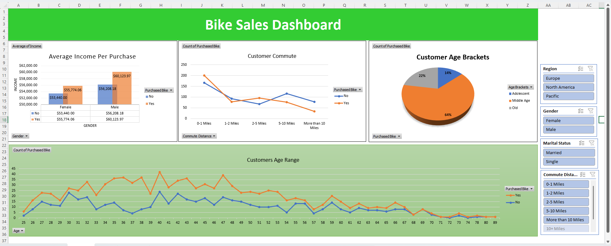

# Bike Sales Dashboard – Excel

An interactive Excel dashboard for analyzing customer demographics, purchasing behavior, income, and commute patterns in a bike sales dataset.

## Dashboard Preview

## Project Overview

This project uses Microsoft Excel to transform customer-level bike sales data into an interactive dashboard.

The dashboard provides insights into:

- Bike purchases by customer demographics
- Average income of customers based on purchase status and gender
- Customer commute distance and bike purchase behavior
- Customer age distribution
- Age-wise bike purchasing patterns
- Regional purchasing patterns
- Purchasing behavior based on gender and marital status

## Dashboard Features

### Key Visualizations

- Average Income Per Purchase
- Customer Commute Distance
- Customer Age Brackets
- Customers Age Range
- Interactive filtering using Excel Slicers

### Interactive Filters

The dashboard includes slicers for:

- Region
- Gender
- Marital Status
- Commute Distance

These filters allow users to dynamically explore different customer segments.

## Excel Skills Used

- Pivot Tables
- Pivot Charts
- Slicers
- Data Cleaning
- Data Transformation
- XLOOKUP
- VLOOKUP
- SUMIFS
- TEXTSPLIT
- MID
- FIND
- TRIM
- ROUNDUP
- ROUNDDOWN
- SORTBY
- Conditional Logic
- Data Aggregation
- Dashboard Design

## Key Analysis Areas

### Customer Demographics

The dashboard analyzes customers across different age groups, genders, regions, and marital statuses.

### Income Analysis

Average customer income is compared between customers who purchased a bike and those who did not, with additional gender-level analysis.

### Commute Analysis

Customer commute distances are analyzed to understand purchasing behavior across different commute ranges.

### Age Analysis

The dashboard visualizes bike purchases across customer ages and provides an age-bracket breakdown.

## Tools

- Microsoft Excel
- Pivot Tables
- Pivot Charts
- Excel Slicers
- Excel Formulas

## Dataset

The project uses a customer bike sales dataset containing demographic, financial, commute, and purchase-related attributes.

## Project Objective

The objective of this project is to demonstrate practical Excel skills for data analysis and dashboard development by converting raw customer data into an interactive and visually understandable business dashboard.
